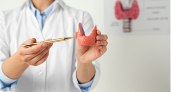

<!DOCTYPE html>
<html lang="en">

<head>
    <meta charset="UTF-8">
    <meta name="viewport" content="width=device-width, initial-scale=1.0">
    <link href="https://fonts.googleapis.com/css2?family=Inter:wght@100..900&display=swap" rel="stylesheet">
    <link rel="stylesheet" href="https://cdnjs.cloudflare.com/ajax/libs/font-awesome/7.0.1/css/all.min.css"
        integrity="sha512-2SwdPD6INVrV/lHTZbO2nodKhrnDdJK9/kg2XD1r9uGqPo1cUbujc+IYdlYdEErWNu69gVcYgdxlmVmzTWnetw=="
        crossorigin="anonymous" referrerpolicy="no-referrer" />
    <title>The-Thyroid-Specialist</title>
    <link rel="stylesheet" href="style.css">
</head>

<body>

    <top-header class="top-heade">
        

            

                

                    <i class="fa-solid fa-phone"></i>
                    
(555) 123-4567

                

                

                    <i class="fa-solid fa-location-dot"></i>
                    
123 Medical Center Drive, Suite 20

                

            

            

                

                    
Mon-Fri: 8AM-5PM | Sat: 9AM-1PM

                

            

        

    </top-header>

    <header class="header">
        

            

                <h1>The Thyroid Specialist</h1>
            

            <nav>
                <ul>
                    <li><a href="index.html">Home</a></li>
                    <li><a href="about.html">About</a></li>
                    <li><a href="">Services</a></li>
                    <li><a href="contact.html">Contact</a></li>
                </ul>

                

                    <button>Book Appointment</button>
                

            </nav>

        

    </header>

    

        

            

                

                    

                

                

                    <h3>Center for Thyroid, Breast, Diabetic Foot and Endocrine Oncosurgery</h3>
                    

                        <h5>Dr. Vivek Aggarwal</h5>
                    

                    
Comprehensive endocrine and oncological surgical care with cutting-edge technology, personalized
                        treatment plans, and compassionate patient support.

                    

                        <button>Schedule Consultation</button>
                        <a href="#">Learn More</a>
                    

                

                

                    

                

            

        

    

    

        

            <h1>Our Specialized Services</h1>
            
Comprehensive thyroid care using the latest medical advances and personalized approaches

        

    

    

        

            

                

                    
                

                

                    

                        <h2>Thyroid Disease</h2>
                        
The thyroid gland regulates metabolism, energy, and hormonal balance. Disorders like
                            hypothyroidism and hyperthyroidism can cause fatigue, weight changes, and mood swings.
                            Treatment
                            often involves medication, lifestyle changes, or surgery depending on severity

                    

                

            

            

                

                    
                

                

                    

                        <h2>Parathyroid</h2>
                        
Parathyroid glands control calcium levels in the blood and bones. Overactivity
                            (hyperparathyroidism) can lead to kidney stones, bone pain, and fatigue. Surgical removal of
                            the
                            affected gland is a common treatment when medication isn’t effective.

                    

                

            

            

                

                    
                

                

                    

                        <h2>Adrenal</h2>
                        
Adrenal glands produce hormones like cortisol and adrenaline. Disorders such as Addison’s
                            disease
                            or Cushing’s syndrome affect stress response, blood pressure, and metabolism. Diagnosis
                            often
                            involves hormone testing and imaging, with treatment ranging from medication to surgery.

                    

                

            

            

                

                    
                

                

                    

                        <h2>Laparoscopic Surgery</h2>
                        
Also known as minimally invasive surgery, this technique uses small incisions and a camera to
                            perform procedures. Benefits include reduced pain, quicker recovery, and minimal scarring.
                            It's
                            commonly used for gallbladder removal, hernia repair, and endocrine surgeries.

                    

                

            

            

                

                    
                

                

                    

                        <h2>Breast Cancer</h2>
                        
Breast cancer ranges from localized tumors to aggressive metastatic disease. Early detection
                            through mammograms and self-exams is key. Treatment may include surgery, chemotherapy,
                            radiation, and hormone therapy. A multidisciplinary approach improves outcomes

                    

                

            

            

                

                    
                

                

                    

                        <h2>Diabetic foot</h2>
                        
Diabetes can impair circulation and nerve function in the feet, increasing the risk of
                            ulcers,
                            infections, and slow healing. Preventive care—like regular foot checks, blood sugar control,
                            and
                            proper footwear—is essential to avoid serious complications

                    

                

            

        

    

    

        

            

                <button>About Dr. Vivek Aggarwal</button>
            

            <h1>Your Trusted Thyroid Specialist</h1>
            
With over 15 years of experience in endocrinology, Dr. Sarah Mitchell is dedicated to  providing
                comprehensive thyroid care with a focus on patient comfort and optimal   health outcomes.

        

    

    

        

            

                
            

            

                <h1>Dedicated to Your Thyroid Health</h1>
                

                    The brain behind "CENTRE FOR THYROID, BREAST AND ENDOCRINE DISORDERS" is Dr. Vivek Aggarwal MS, MCh
                    (Endocrine Surg) who is the First Endocrine Surgeon of Delhi & International Surgical Foundation
                    Grant Awardee, Montreal, Canada.
                

                

                    He is a leading Endocrine specialist with years of rich experience behind him. His dream is to
                    provide complete Endocrine solutions to the society at a very nominal price. He has many rewards to
                    his credit and is an avid worker in the field of endocrine Surgery.
                

                

                    <button>
                        Know Your Doctor
                        →
                    </button>
                

            

        

    

    

        

            <h2>Ready to Take Control of Your Thyroid Health?</h2>
            
Don't let thyroid issues hold you back. Take the first step towards better health  with a
                comprehensive evaluation from our experienced team.

            

                

                    <button>Schedule Your Consultation</button>
                

                

                    <button>Learn More about Our services</button>
                

            

        

    

    

        

            <h1>Your Treatment Journey</h1>
            
A clear, step-by-step approach to your thyroid health 

        

    

    

        

            

                

                    

                        <h3>Initial</h3>
                        <h2>Consultation</h2>
                    

                    

                        
Comprehensive health  assessment and symptom  evaluation

                    

                    

                        <button>60-Minuts</button>
                    

                    
→

                

            

            

                

                    <h1>Diagnostic Testing</h1>
                

                

                    
Comprehensive health  assessment and symptom  evaluation

                

                

                    <button>1-2 Days</button>
                

                
→

            

            

                

                    <h3>Treatment</h3>
                    <h2>planning</h2>
                

                

                    
Personalized treatment plan development

                

                

                    <button>30 Minuts</button>
                

                
→

            

            

                

                    <h1>Ongoing Care</h1>
                

                

                    
Regular monitoring and  treatment adjustments

                

                

                    <button>Ongoing</button>
                

                

            

        

    

    

        

            

                

                    <button>100+ Five-Star Reviews</button>
                

            

            

                <h1>Life-Changing Results</h1>
                <h2>Real Patient Stories</h2>
            

            

                
Discover how our personalized thyroid care has transformed the lives   of patients across Texas
                

            

        

    

    

        

            

                <h1>500+</h1>
                
Happy Patients

            

            

                

                    <h1>4.9</h1>
                    <h2>★</h2>
                

                
Star Avg Rating

            

            

                <h1>100%</h1>
                
Success Rate

            

            

                <h1>15+</h1>
                
Years Experience

            

        

    

    

        

            

                

                    

                        

                            

                                
                            

                            

                                
Sarah M.

                                <input type="radio" name="star" id="star5">
                                <label for="star5">★</label>

                                <input type="radio" name="star" id="star4">
                                <label for="star4">★</label>

                                <input type="radio" name="star" id="star3">
                                <label for="star3">★</label>

                                <input type="radio" name="star" id="star2">
                                <label for="star2">★</label>

                                <input type="radio" name="star" id="star1">
                                <label for="star1">★</label>
                            

                        

                        

                            

                                
Condition

                                

                                    <button>Hypothyroidism</button>
                                

                            

                        

                    

                

                

                    

                        <a href="#">"After years of struggling with thyroid issues,</a>
                        
I finally found relief under Dr. Vivek Aggarwal’s care. His
                            expertise and compassionate approach made all the difference. From diagnosis to treatment,
                            everything was
                            clearly explained and tailored to my needs. I feel healthier, more energetic, and truly
                            grateful for the support
                            I received at the Centre.

                    

                

            

            

            

                

                    Treatment Journey
                

                

                    

                        

                            Initial Consultation
                        

                        

                            <button>60 Minutes</button>
                        

                    

                    

                        

                            Diagnostic Testing
                        

                        

                            <button>2 Days</button>
                        

                    

                    

                        

                            Treatment Planning
                        

                        

                            <button>30 Minutes</button>
                        

                    

                    

                        
Ongoing Care

                        
<button>Ongoing</button>

                    

                

            

        

    

    

        

            

                

                    

                        

                            

                                
                            

                            

                                
Sarah M.

                                <input type="radio" name="star" id="star5">
                                <label for="star5">★</label>

                                <input type="radio" name="star" id="star4">
                                <label for="star4">★</label>

                                <input type="radio" name="star" id="star3">
                                <label for="star3">★</label>

                                <input type="radio" name="star" id="star2">
                                <label for="star2">★</label>

                                <input type="radio" name="star" id="star1">
                                <label for="star1">★</label>
                            

                        

                        

                            

                                
                            

                        

                    

                    

                        
"Dr. Thompson changed my life. After years of fatigue, I finally got the right diagnosis and
                            treatment."

                    

                    

                        

                            <a href="#">Condition</a>
                            <a href="#">Treatment</a>
                        

                        

                            

                                <button>Hypothyroidism</button>
                            

                            
6 Months of Treatment

                        

                    

                

            

            

                

                    

                        

                            

                                
                            

                            

                                
Sarah M.

                                <input type="radio" name="star" id="star5">
                                <label for="star5">★</label>

                                <input type="radio" name="star" id="star4">
                                <label for="star4">★</label>

                                <input type="radio" name="star" id="star3">
                                <label for="star3">★</label>

                                <input type="radio" name="star" id="star2">
                                <label for="star2">★</label>

                                <input type="radio" name="star" id="star1">
                                <label for="star1">★</label>
                            

                        

                        

                            

                                
                            

                        

                    

                    

                        
"Dr. Thompson changed my life. After years of fatigue, I finally got the right diagnosis and
                            treatment."

                    

                    

                        

                            <a href="#">Condition</a>
                            <a href="#">Treatment</a>
                        

                        

                            

                                <button>Hypothyroidism</button>
                            

                            
6 Months of Treatment

                        

                    

                

            

            

                

                    

                        

                            

                                
                            

                            

                                
Sarah M.

                                <input type="radio" name="star" id="star5">
                                <label for="star5">★</label>

                                <input type="radio" name="star" id="star4">
                                <label for="star4">★</label>

                                <input type="radio" name="star" id="star3">
                                <label for="star3">★</label>

                                <input type="radio" name="star" id="star2">
                                <label for="star2">★</label>

                                <input type="radio" name="star" id="star1">
                                <label for="star1">★</label>
                            

                        

                        

                            

                                
                            

                        

                    

                    

                        
"Dr. Thompson changed my life. After years of fatigue, I finally got the right diagnosis and
                            treatment."

                    

                    

                        

                            <a href="#">Condition</a>
                            <a href="#">Treatment</a>
                        

                        

                            

                                <button>Hypothyroidism</button>
                            

                            
6 Months of Treatment

                        

                    

                

            

        

    

    

        

            

                <button>
                    <i class="fa-solid fa-phone"></i>
                    Contact Us
                </button>
            

            <h1>Schedule Your Consultation Today</h1>
            
Take the first step towards optimal thyroid health. Our friendly team is  ready to help you schedule
                your appointment and answer any questions.

            

                
                

                    
Schedule your appointment

                    <h1>on Whatsapp</h1>
                

            

        

    

    

        

            

                <h1>Request an  Appointment</h1>
                

                    <input type="text" name="name" id="name" placeholder="Your Name">
                

                

                    <input type="text" name="name" id="name" placeholder="Your Phone">
                

                

                    <select name="name" id="value">
                        <option value="name">Are you a new patient</option>
                        <option value="name">YES</option>
                        <option value="name">NO</option>
                    </select>
                

                

                    <select name="name" id="value">
                        <option value="name">Appointment Type</option>
                        <option value="name">YES</option>
                        <option value="name">NO</option>
                    </select>
                

                

                    <select name="name" id="value">
                        <option value="name">Preferred Date</option>
                        <option value="name">YES</option>
                        <option value="name">NO</option>
                    </select>

                    <select name="name" id="value">
                        <option value="name">Preferred Time</option>
                        <option value="name">YES</option>
                        <option value="name">NO</option>
                    </select>
                

                

                    <textarea name="massage" id="massage" placeholder="Message or Questions"></textarea>
                

                

                    <input type="checkbox" name="agree" id="agree">
                    <label for="agree">I agree to be contacted by The thyroid specialist</label>
                

                

                    <button>Submite</button>
                

            

            

                
            

        

    

    

        

            

                

                    <h1>The Thyroid Specialist</h1>
                    

                        <button>Thyroid & Endocrine Specialist</button>
                    

                

                

                    
Board-certified endocrinologist specializing in thyroid and hormone disorders. Providing
                        compassionate, evidence-based care with a focus on personalized treatment plans for over 15
                        years.

                    

                        

                            
                        

                        

                            
                        

                        

                            
                        

                    

                

            

            

                

                    <h1>Navigation</h1>
                    

                        <a href="#">Home</a>
                        <a href="#">About</a>
                        <a href="#">Services</a>
                        <a href="#">Contact</a>
                        <a href="#">Book Appointment</a>
                    

                

                

                    <h1>Get in Touch</h1>
                    

                        

                            <i class="fa-solid fa-phone"></i>
                            <a href="#">9999349230</a>
                        

                        </a>
                        

                            <i class="fa-solid fa-envelope"></i>
                            <a href="#">dr.vivekaggarwal@yahoo.com</a>
                        

                        

                            <i class="fa-solid fa-location-dot"></i>
                            <a href="#">65 A, Ekta Appartment
                                A2B Block, Paschim ViharNew Delhi - 110063</a>
                        

                    

                

            

        

        

            

                

                    <h1>Monday - Friday   8:00 AM - 5:00 PM</h1>
                

                

                    <h1>Working Schedule</h1> 
                    <h1>Saturday</h1>9:00 AM - 1:00 PM</h1>
                

                

                    <h1>Sunday  closed</h1>

                

            

        

        

            
© 2025 The Thyroid Specialist. All rights reserved. | Dedicated to your thyroid health and wellbeing.

        

    

</body>

</html>
</style>

<body>

    <top-header class="top-heade">
        

            

                

                    <i class="fa-solid fa-phone"></i>
                    
(555) 123-4567

                

                

                    <i class="fa-solid fa-location-dot"></i>
                    
123 Medical Center Drive, Suite 20

                

            

            

                

                    
Mon-Fri: 8AM-5PM | Sat: 9AM-1PM

                

            

        

    </top-header>

    <header class="header">
        

            

                <h1>The Thyroid Specialist</h1>
            

            <nav>
                <ul>
                    <li><a href="index.html">Home</a></li>
                    <li><a href="about.html">About</a></li>
                    <li><a href="">Services</a></li>
                    <li><a href="contact.html">Contact</a></li>
                </ul>

                

                    <button>Book Appointment</button>
                

            </nav>

        

    </header>

    

        

            

                

                    

                

                

                    <h3>Center for Thyroid, Breast, Diabetic Foot and Endocrine Oncosurgery</h3>
                    

                        <h5>Dr. Vivek Aggarwal</h5>
                    

                    
Comprehensive endocrine and oncological surgical care with cutting-edge technology, personalized
                        treatment plans, and compassionate patient support.

                    

                        <button>Schedule Consultation</button>
                        <a href="#">Learn More</a>
                    

                

                

                    

                

            

        

    

    

        

            <h1>Our Specialized Services</h1>
            
Comprehensive thyroid care using the latest medical advances and personalized approaches

        

    

    

        

            

                

                    
                

                

                    

                        <h2>Thyroid Disease</h2>
                        
The thyroid gland regulates metabolism, energy, and hormonal balance. Disorders like
                            hypothyroidism and hyperthyroidism can cause fatigue, weight changes, and mood swings.
                            Treatment
                            often involves medication, lifestyle changes, or surgery depending on severity

                    

                

            

            

                

                    
                

                

                    

                        <h2>Parathyroid</h2>
                        
Parathyroid glands control calcium levels in the blood and bones. Overactivity
                            (hyperparathyroidism) can lead to kidney stones, bone pain, and fatigue. Surgical removal of
                            the
                            affected gland is a common treatment when medication isn’t effective.

                    

                

            

            

                

                    
                

                

                    

                        <h2>Adrenal</h2>
                        
Adrenal glands produce hormones like cortisol and adrenaline. Disorders such as Addison’s
                            disease
                            or Cushing’s syndrome affect stress response, blood pressure, and metabolism. Diagnosis
                            often
                            involves hormone testing and imaging, with treatment ranging from medication to surgery.

                    

                

            

            

                

                    
                

                

                    

                        <h2>Laparoscopic Surgery</h2>
                        
Also known as minimally invasive surgery, this technique uses small incisions and a camera to
                            perform procedures. Benefits include reduced pain, quicker recovery, and minimal scarring.
                            It's
                            commonly used for gallbladder removal, hernia repair, and endocrine surgeries.

                    

                

            

            

                

                    
                

                

                    

                        <h2>Breast Cancer</h2>
                        
Breast cancer ranges from localized tumors to aggressive metastatic disease. Early detection
                            through mammograms and self-exams is key. Treatment may include surgery, chemotherapy,
                            radiation, and hormone therapy. A multidisciplinary approach improves outcomes

                    

                

            

            

                

                    
                

                

                    

                        <h2>Diabetic foot</h2>
                        
Diabetes can impair circulation and nerve function in the feet, increasing the risk of
                            ulcers,
                            infections, and slow healing. Preventive care—like regular foot checks, blood sugar control,
                            and
                            proper footwear—is essential to avoid serious complications

                    

                

            

        

    

    

        

            

                <button>About Dr. Vivek Aggarwal</button>
            

            <h1>Your Trusted Thyroid Specialist</h1>
            
With over 15 years of experience in endocrinology, Dr. Sarah Mitchell is dedicated to  providing
                comprehensive thyroid care with a focus on patient comfort and optimal   health outcomes.

        

    

    

        

            

                
            

            

                <h1>Dedicated to Your Thyroid Health</h1>
                

                    The brain behind "CENTRE FOR THYROID, BREAST AND ENDOCRINE DISORDERS" is Dr. Vivek Aggarwal MS, MCh
                    (Endocrine Surg) who is the First Endocrine Surgeon of Delhi & International Surgical Foundation
                    Grant Awardee, Montreal, Canada.
                

                

                    He is a leading Endocrine specialist with years of rich experience behind him. His dream is to
                    provide complete Endocrine solutions to the society at a very nominal price. He has many rewards to
                    his credit and is an avid worker in the field of endocrine Surgery.
                

                

                    <button>
                        Know Your Doctor
                        →
                    </button>
                

            

        

    

    

        

            <h2>Ready to Take Control of Your Thyroid Health?</h2>
            
Don't let thyroid issues hold you back. Take the first step towards better health  with a
                comprehensive evaluation from our experienced team.

            

                

                    <button>Schedule Your Consultation</button>
                

                

                    <button>Learn More about Our services</button>
                

            

        

    

    

        

            <h1>Your Treatment Journey</h1>
            
A clear, step-by-step approach to your thyroid health 

        

    

    

        

            

                

                    

                        <h3>Initial</h3>
                        <h2>Consultation</h2>
                    

                    

                        
Comprehensive health  assessment and symptom  evaluation

                    

                    

                        <button>60-Minuts</button>
                    

                    
→

                

            

            

                

                    <h1>Diagnostic Testing</h1>
                

                

                    
Comprehensive health  assessment and symptom  evaluation

                

                

                    <button>1-2 Days</button>
                

                
→

            

            

                

                    <h3>Treatment</h3>
                    <h2>planning</h2>
                

                

                    
Personalized treatment plan development

                

                

                    <button>30 Minuts</button>
                

                
→

            

            

                

                    <h1>Ongoing Care</h1>
                

                

                    
Regular monitoring and  treatment adjustments

                

                

                    <button>Ongoing</button>
                

                

            

        

    

    

        

            

                

                    <button>100+ Five-Star Reviews</button>
                

            

            

                <h1>Life-Changing Results</h1>
                <h2>Real Patient Stories</h2>
            

            

                
Discover how our personalized thyroid care has transformed the lives   of patients across Texas
                

            

        

    

    

        

            

                <h1>500+</h1>
                
Happy Patients

            

            

                

                    <h1>4.9</h1>
                    <h2>★</h2>
                

                
Star Avg Rating

            

            

                <h1>100%</h1>
                
Success Rate

            

            

                <h1>15+</h1>
                
Years Experience

            

        

    

    

        

            

                

                    

                        

                            

                                
                            

                            

                                
Sarah M.

                                <input type="radio" name="star" id="star5">
                                <label for="star5">★</label>

                                <input type="radio" name="star" id="star4">
                                <label for="star4">★</label>

                                <input type="radio" name="star" id="star3">
                                <label for="star3">★</label>

                                <input type="radio" name="star" id="star2">
                                <label for="star2">★</label>

                                <input type="radio" name="star" id="star1">
                                <label for="star1">★</label>
                            

                        

                        

                            

                                
Condition

                                

                                    <button>Hypothyroidism</button>
                                

                            

                        

                    

                

                

                    

                        <a href="#">"After years of struggling with thyroid issues,</a>
                        
I finally found relief under Dr. Vivek Aggarwal’s care. His
                            expertise and compassionate approach made all the difference. From diagnosis to treatment,
                            everything was
                            clearly explained and tailored to my needs. I feel healthier, more energetic, and truly
                            grateful for the support
                            I received at the Centre.

                    

                

            

            

            

                

                    Treatment Journey
                

                

                    

                        

                            Initial Consultation
                        

                        

                            <button>60 Minutes</button>
                        

                    

                    

                        

                            Diagnostic Testing
                        

                        

                            <button>2 Days</button>
                        

                    

                    

                        

                            Treatment Planning
                        

                        

                            <button>30 Minutes</button>
                        

                    

                    

                        
Ongoing Care

                        
<button>Ongoing</button>

                    

                

            

        

    

    

        

            

                

                    

                        

                            

                                
                            

                            

                                
Sarah M.

                                <input type="radio" name="star" id="star5">
                                <label for="star5">★</label>

                                <input type="radio" name="star" id="star4">
                                <label for="star4">★</label>

                                <input type="radio" name="star" id="star3">
                                <label for="star3">★</label>

                                <input type="radio" name="star" id="star2">
                                <label for="star2">★</label>

                                <input type="radio" name="star" id="star1">
                                <label for="star1">★</label>
                            

                        

                        

                            

                                
                            

                        

                    

                    

                        
"Dr. Thompson changed my life. After years of fatigue, I finally got the right diagnosis and
                            treatment."

                    

                    

                        

                            <a href="#">Condition</a>
                            <a href="#">Treatment</a>
                        

                        

                            

                                <button>Hypothyroidism</button>
                            

                            
6 Months of Treatment

                        

                    

                

            

            

                

                    

                        

                            

                                
                            

                            

                                
Sarah M.

                                <input type="radio" name="star" id="star5">
                                <label for="star5">★</label>

                                <input type="radio" name="star" id="star4">
                                <label for="star4">★</label>

                                <input type="radio" name="star" id="star3">
                                <label for="star3">★</label>

                                <input type="radio" name="star" id="star2">
                                <label for="star2">★</label>

                                <input type="radio" name="star" id="star1">
                                <label for="star1">★</label>
                            

                        

                        

                            

                                
                            

                        

                    

                    

                        
"Dr. Thompson changed my life. After years of fatigue, I finally got the right diagnosis and
                            treatment."

                    

                    

                        

                            <a href="#">Condition</a>
                            <a href="#">Treatment</a>
                        

                        

                            

                                <button>Hypothyroidism</button>
                            

                            
6 Months of Treatment

                        

                    

                

            

            

                

                    

                        

                            

                                
                            

                            

                                
Sarah M.

                                <input type="radio" name="star" id="star5">
                                <label for="star5">★</label>

                                <input type="radio" name="star" id="star4">
                                <label for="star4">★</label>

                                <input type="radio" name="star" id="star3">
                                <label for="star3">★</label>

                                <input type="radio" name="star" id="star2">
                                <label for="star2">★</label>

                                <input type="radio" name="star" id="star1">
                                <label for="star1">★</label>
                            

                        

                        

                            

                                
                            

                        

                    

                    

                        
"Dr. Thompson changed my life. After years of fatigue, I finally got the right diagnosis and
                            treatment."

                    

                    

                        

                            <a href="#">Condition</a>
                            <a href="#">Treatment</a>
                        

                        

                            

                                <button>Hypothyroidism</button>
                            

                            
6 Months of Treatment

                        

                    

                

            

        

    

    

        

            

                <button>
                    <i class="fa-solid fa-phone"></i>
                    Contact Us
                </button>
            

            <h1>Schedule Your Consultation Today</h1>
            
Take the first step towards optimal thyroid health. Our friendly team is  ready to help you schedule
                your appointment and answer any questions.

            

                
                

                    
Schedule your appointment

                    <h1>on Whatsapp</h1>
                

            

        

    

    

        

            

                <h1>Request an  Appointment</h1>
                

                    <input type="text" name="name" id="name" placeholder="Your Name">
                

                

                    <input type="text" name="name" id="name" placeholder="Your Phone">
                

                

                    <select name="name" id="value">
                        <option value="name">Are you a new patient</option>
                        <option value="name">YES</option>
                        <option value="name">NO</option>
                    </select>
                

                

                    <select name="name" id="value">
                        <option value="name">Appointment Type</option>
                        <option value="name">YES</option>
                        <option value="name">NO</option>
                    </select>
                

                

                    <select name="name" id="value">
                        <option value="name">Preferred Date</option>
                        <option value="name">YES</option>
                        <option value="name">NO</option>
                    </select>

                    <select name="name" id="value">
                        <option value="name">Preferred Time</option>
                        <option value="name">YES</option>
                        <option value="name">NO</option>
                    </select>
                

                

                    <textarea name="massage" id="massage" placeholder="Message or Questions"></textarea>
                

                

                    <input type="checkbox" name="agree" id="agree">
                    <label for="agree">I agree to be contacted by The thyroid specialist</label>
                

                

                    <button>Submite</button>
                

            

            

                
            

        

    

    

        

            

                

                    <h1>The Thyroid Specialist</h1>
                    

                        <button>Thyroid & Endocrine Specialist</button>
                    

                

                

                    
Board-certified endocrinologist specializing in thyroid and hormone disorders. Providing
                        compassionate, evidence-based care with a focus on personalized treatment plans for over 15
                        years.

                    

                        

                            
                        

                        

                            
                        

                        

                            
                        

                    

                

            

            

                

                    <h1>Navigation</h1>
                    

                        <a href="#">Home</a>
                        <a href="#">About</a>
                        <a href="#">Services</a>
                        <a href="#">Contact</a>
                        <a href="#">Book Appointment</a>
                    

                

                

                    <h1>Get in Touch</h1>
                    

                        

                            <i class="fa-solid fa-phone"></i>
                            <a href="#">9999349230</a>
                        

                        </a>
                        

                            <i class="fa-solid fa-envelope"></i>
                            <a href="#">dr.vivekaggarwal@yahoo.com</a>
                        

                        

                            <i class="fa-solid fa-location-dot"></i>
                            <a href="#">65 A, Ekta Appartment
                                A2B Block, Paschim ViharNew Delhi - 110063</a>
                        

                    

                

            

        

        

            

                

                    <h1>Monday - Friday   8:00 AM - 5:00 PM</h1>
                

                

                    <h1>Working Schedule</h1> 
                    <h1>Saturday</h1>9:00 AM - 1:00 PM</h1>
                

                

                    <h1>Sunday  closed</h1>

                

            

        

        

            
© 2025 The Thyroid Specialist. All rights reserved. | Dedicated to your thyroid health and wellbeing.

        

    

</body>

</html>
